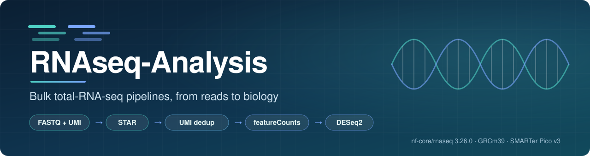
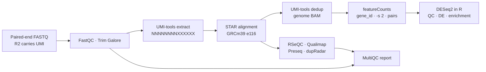

<p align="center">
  
</p>

<p align="center">
  
  
  
  
  
</p>

<p align="center">
  <a href="#overview">Overview</a> ·
  <a href="#pipeline-at-a-glance">Pipeline</a> ·
  <a href="#repository-layout">Layout</a> ·
  <a href="#quick-start-a-new-experiment">Quick start</a> ·
  <a href="#quality-control-checklist">QC checklist</a> ·
  <a href="#projects">Projects</a>
</p>

---

## Overview

This repository holds the code, configuration and documentation for bulk RNA-seq experiments run in the lab. Every experiment follows the same path:

1. **Upstream processing** with [nf-core/rnaseq](https://nf-co.re/rnaseq). This covers read QC, trimming, UMI extraction, STAR alignment, UMI deduplication and alignment QC.
2. **Gene-level counting** with `featureCounts` on the UMI-deduplicated genome alignments.
3. **Downstream analysis** in R. This covers DESeq2 differential expression, QC plots and functional enrichment.

Shared, reusable pieces live in [`shared/`](shared). Each experiment lives in its own dated folder under [`projects/`](projects), with the exact configuration it was run with and its own analysis document. Raw data and results are **not** stored in git.

## Pipeline at a glance



| Step | Tool | Key settings |
|---|---|---|
| Library kit | Takara **SMARTer Stranded Total RNA-Seq Kit v3, Pico Input Mammalian** | ribo-depleted total RNA (not poly-A) |
| UMI | UMI-tools `extract` (string method) | Read 2: 8 nt UMI + 6 nt discarded, `NNNNNNNNXXXXXX` |
| Strandedness | set explicitly | `reverse` (Read 1 antisense), checked by RSeQC `infer_experiment` |
| Alignment | STAR via nf-core `star_salmon` | `--sjdbOverhang` = read length − 1 (160 for 2×161 bp) |
| Deduplication | UMI-tools `dedup` | genome-level BAM, which feeds the gene counts |
| Counting | subread `featureCounts` 2.0.6 | `-p --countReadPairs -B -C -s 2 -t exon -g gene_id` |
| Statistics | DESeq2 | joint normalisation across all samples; contrasts per design |

> [!IMPORTANT]
> **Paired-end counting:** in featureCounts ≥ 2.0.2, `-p` only declares the data as paired-end. Add **`--countReadPairs`** so each fragment counts once, then confirm the log shows `Count read pairs : yes`. Without it, both reads of a pair are counted separately.

## Repository layout

```text
RNAseq-Analysis/
├── README.md                    ← you are here (generic pipeline overview)
├── assets/                      ← images for documentation
├── shared/
│   ├── templates/               ← starting point for every new experiment
│   │   ├── nextflow.config        pipeline + kit settings (edit lines marked CHANGE_ME)
│   │   ├── samplesheet.csv        nf-core samplesheet format
│   │   ├── sample_metadata.csv    per-sample design / covariate table for DESeq2
│   │   ├── run_group.sh           nf-core/rnaseq + featureCounts for one sample group
│   │   └── backup_group.sh        copy a group's results to backup storage and verify
│   ├── envs/environment-r.yml   ← conda env for downstream R analysis (DESeq2 etc.)
│   └── docs/                    ← compute-environment setup (WSL2, conda, Apptainer)
└── projects/
    └── <Project>/
        ├── README.md            ← project overview + list of its experiments
        └── <YYYY-MM_tissue_design>/
            ├── config/          nextflow.config + samplesheets exactly as run
            ├── scripts/         launch / counting / backup scripts
            ├── analysis/        R Markdown and downstream code
            └── docs/            experiment-specific analysis document
```

**Projects and experiments.** A *project* is a biological question, such as a mouse model or an intervention. An *experiment* is one sequencing dataset within it: the first cohort, a repeat, a pilot or a follow-up. Each experiment keeps its own configuration, so older experiments never change when the templates improve.

## Quick start: a new experiment

**1. Environment** (one time; details in [`shared/docs/WSL2_Environment_Setup.md`](shared/docs/WSL2_Environment_Setup.md))

```bash
conda activate nfcore                      # Nextflow 25.04 + Apptainer + nf-core tools
nextflow pull nf-core/rnaseq -r 3.26.0
conda env create -f shared/envs/environment-r.yml   # downstream R env: rnaseq-r
```

**2. Create the experiment folder from the templates**

```bash
EXP=projects/<Project>/<YYYY-MM_tissue_design>
mkdir -p $EXP/{config,scripts,analysis,docs}
cp shared/templates/{nextflow.config,samplesheet.csv,sample_metadata.csv} $EXP/config/
cp shared/templates/{run_group.sh,backup_group.sh} $EXP/scripts/
grep -rn CHANGE_ME $EXP                    # edit every hit
```

**3. Check the inputs before running**

- **Read length:** `zcat R1.fastq.gz | awk 'NR%4==2{print length($0)}' | sort | uniq -c | head`. If it isn't 161 bp, rebuild the STAR index with `--sjdbOverhang` = length − 1.
- **UMI structure** on Read 2, and **md5 checksums** of the raw files. Keep an untouched copy of the raw data on backup storage.
- **Samplesheet:** one row per sample, named `<GROUP>_<n>` and split per group as `samplesheet_<GROUP>.csv`.

**4. Run one group at a time** (keeps peak disk use bounded; the alignments take about 50–65 GB per sample)

```bash
cd $EXP
setsid nohup bash scripts/run_group.sh <GROUP> > ~/nf-work/logs/run_<GROUP>_$(date +%Y%m%d_%H%M%S).log 2>&1 < /dev/null &
bash scripts/backup_group.sh <GROUP>       # prints "BACKUP VERIFIED" only if every file matches
```

**5. Downstream analysis**

```bash
conda activate rnaseq-r
Rscript -e 'rmarkdown::render("analysis/<analysis>.Rmd")'
```

## Quality control checklist

Complete these **before** interpreting any differential expression result.

| Check | Where | Expect |
|---|---|---|
| Strandedness | MultiQC → RSeQC infer_experiment | about 90%+ of reads `1+-,1-+,2++,2--` (reverse) |
| Mapping and duplication | MultiQC → STAR, UMI-tools | high unique mapping; dedup rate consistent across samples |
| rRNA / mitochondrial fraction | featureCounts biotype, idxstats | low and similar across samples |
| Gene-body coverage | Qualimap 5′–3′ bias, RSeQC | about 1.0; no sample with strong 3′ bias |
| **Pair counting** | featureCounts log and summary | `Count read pairs : yes`; assigned ≤ deduplicated pairs |
| **All samples together** | PCA and sample-distance heatmap on VST counts | samples group by biology, not by batch or quality; if not, find out why |
| **Cell-type purity** | marker genes of the target and neighbouring cell types | contamination low and similar across groups |
| **Single-sample drivers** | per-gene counts of top hits | a hit is not driven by one sample (watch groups with n < 3) |

Also state the replicate number wherever results are shown. With n = 2 per group, DESeq2's outlier detection is inactive and dispersion estimates are unstable.

## Conventions

- **Naming:** projects are `PascalCase-With-Hyphens`; experiments are `YYYY-MM_tissue_design`; samples are `<GROUP>_<replicate>`.
- **Not in git:** FASTQ, BAM, count matrices and `results*/` (see [`.gitignore`](.gitignore)). Keep them on local disk and verified backup storage.
- **Keep deduplicated BAMs until counts are final.** Re-counting without them means realigning from FASTQ.
- **Record decisions** in the experiment's `docs/` file as they happen: the date, what was decided and why.
- **Pin versions:** nf-core/rnaseq release, container images, reference release and R session info.

## Projects

| Project | Experiments | Summary |
|---|---|---|
| [OB-OB](projects/OB-OB) | `2026-09_oocytes_wt-het-homo` | leptin-deficient (ob/ob) mice: wild type vs heterozygous vs homozygous |
| [Aging-Intervention](projects/Aging-Intervention) | `2026-09_2m-9m-curcumin-pul` | aging (2 vs 9 months) and rescue by curcumin or plumbagin |

## Software

[nf-core/rnaseq](https://nf-co.re/rnaseq) · [Nextflow](https://www.nextflow.io) · [STAR](https://github.com/alexdobin/STAR) · [UMI-tools](https://github.com/CGATOxford/UMI-tools) · [Subread / featureCounts](https://subread.sourceforge.net) · [Salmon](https://combine-lab.github.io/salmon) · [DESeq2](https://bioconductor.org/packages/DESeq2) · [clusterProfiler](https://bioconductor.org/packages/clusterProfiler)

Please cite nf-core/rnaseq and the individual tools when publishing. The pipeline writes a full list with versions to `pipeline_info/` in each results folder.
